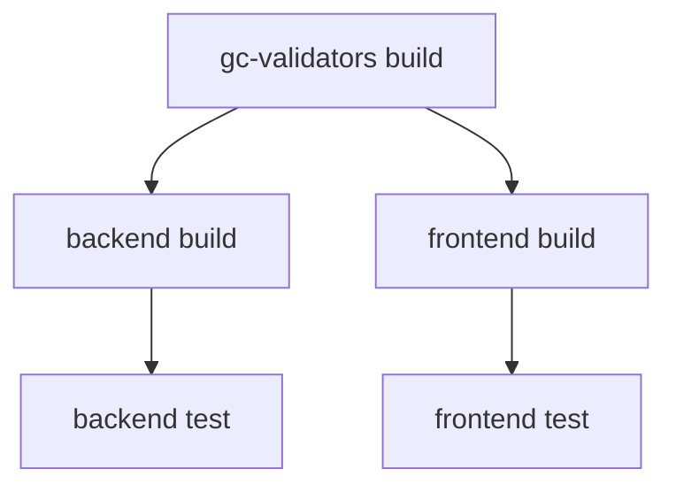
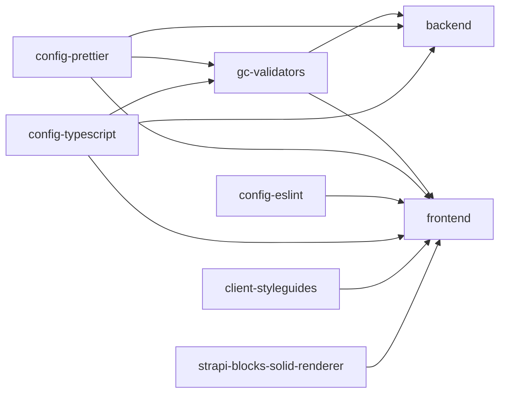

# Turborepo Setup for GetCommunity Monorepo

This monorepo uses [Turborepo](https://turbo.build/repo) to manage the GetCommunity fullstack application, which consists of multiple apps and shared packages organized as git submodules.

## Architecture Overview

### Apps (Git Submodules in `apps/`)

- **backend** (`gc-strapi`) - Strapi CMS backend deployed to AWS EC2
- **frontend** (`gc-cf-www-ssr`) - SolidJS frontend deployed via Cloudflare Pages
- **gcui-docs** - UI documentation site

### Packages (Git Submodules in `packages/`)

- **gc-validators** - Shared validation schemas using Valibot (published to npm)
- **config-prettier** - Shared Prettier configuration
- **config-eslint** - Shared ESLint configuration
- **config-typescript** - Shared TypeScript configuration
- **client-styleguides** - Client-facing style guidelines tailwindcss plugins
- **strapi-blocks-solid-renderer** - Renderer for Strapi blocks in SolidJS

### Other Submodules

- **docs** - Project documentation
- **data** (`gc-data`) - Data management

## Why Git Submodules?

This monorepo uses git submodules for apps and packages because:

1. **Independent Deployment** - Backend and frontend have separate deployment pipelines:
   - Frontend: Auto-deploys via Cloudflare on push to main
   - Backend: Deploys to AWS EC2 with separate build process
2. **Package Publishing** - `gc-validators` is published to npm as a standalone library
3. **Repository Independence** - Each submodule can be worked on independently
4. **Version Control** - Explicit versioning for shared packages

## Turborepo Benefits

Even with git submodules, Turborepo provides:

- ✅ **Intelligent Caching** - Build once, reuse everywhere
- ✅ **Task Orchestration** - Automatic dependency-aware task execution
- ✅ **Parallel Execution** - Run tasks across workspaces simultaneously
- ✅ **Incremental Builds** - Only rebuild what changed
- ✅ **Shared Configuration** - Centralized task definitions

## Common Commands

### Development

```bash
# Start both backend and frontend
pnpm dev:www

# Start backend only (Strapi)
pnpm dev:backend

# Start frontend only (SolidJS)
pnpm dev:frontend

# Start all dev servers
pnpm dev
```

### Building

```bash
# Build all packages and apps
pnpm build

# Build only gc-validators
pnpm build:validators

# Build all apps (backend + frontend)
pnpm build:apps

# Build all packages
pnpm build:packages
```

### Testing

```bash
# Run all tests
pnpm test

# Run backend E2E tests
pnpm test:backend
```

### Linting & Type Checking

```bash
# Lint all workspaces
pnpm lint

# Lint and auto-fix
pnpm lint:fix

# Type check all workspaces
pnpm typecheck

# Format all code
pnpm format
```

### Dependency Management

```bash
# Update gc-validators in both apps
pnpm update-validators

# Update in frontend only
pnpm update:frontend-validators

# Update in backend only
pnpm update:backend-validators

# Install dependencies in all workspaces
pnpm install:all
```

### Visualization

```bash
# Generate interactive dependency graph (HTML)
pnpm graph

# Generate dev dependency graph
pnpm graph:dev

# Generate build graph as PNG
pnpm graph:build:all
```

### Cleanup

```bash
# Clean all build artifacts and caches
pnpm clean
```

## Turborepo Configuration

### Task Pipeline

The `turbo.json` defines the following task pipeline:

#### `build`

- **Caching**: ✅ Enabled
- **Dependencies**: Runs after `^build` (dependencies build first)
- **Outputs**: `dist/`, `.output/`, `.nitro/`, `.strapi/`, `build/`
- **Use Case**: Production builds

#### `dev`

- **Caching**: ❌ Disabled (always fresh)
- **Persistent**: ✅ Long-running process
- **Use Case**: Local development servers

#### `lint`

- **Caching**: ✅ Enabled
- **Dependencies**: Runs after `^build` (needs built packages)
- **Inputs**: Source files + config files
- **Use Case**: Code quality checks

#### `typecheck`

- **Caching**: ✅ Enabled
- **Dependencies**: Runs after `^build` (needs built types)
- **Inputs**: TypeScript files + tsconfig files
- **Use Case**: Type validation

#### `test`

- **Caching**: ✅ Enabled
- **Dependencies**: Runs after `build` and `^build`
- **Outputs**: `coverage/`
- **Use Case**: Running test suites

#### `format`

- **Caching**: ❌ Disabled (modifies files)
- **Use Case**: Code formatting

#### `clean`

- **Caching**: ❌ Disabled (cleanup task)
- **Use Case**: Remove build artifacts

### Environment Variables

#### Shared Variables (globalEnv)

These environment variables are shared between backend and frontend:

- `PREVIEW_SECRET` - Preview mode authentication
- `RECAPTCHA_SECRET_KEY` - reCAPTCHA server-side key
- `SHARPSPRING_ID` - SharpSpring integration ID
- `SHARPSPRING_SECRET_KEY` - SharpSpring API key
- `TEAMWORK_AUTH_TOKEN` - Teamwork API token
- `VITE_GA4_STREAM_ID` - Google Analytics 4 stream ID
- `VITE_RECAPTCHA_SITE_KEY` - reCAPTCHA client-side key
- `VITE_SHARPSPRING_CLIENT_ID` - SharpSpring client ID
- `VITE_SHARPSPRING_DOMAIN_ID` - SharpSpring domain ID

These are defined in `globalEnv` (affects cache keys) and `globalPassThroughEnv` (passed to tasks).

#### Repository-Specific Variables

Each app/package manages its own additional environment variables in their respective `.env` files.

## Working with Git Submodules

### Updating Submodules

Submodules are typically updated from their respective directories:

```bash
# Update backend
cd apps/backend
git pull origin main
cd ../..
git add apps/backend
git commit -m "Update backend submodule"

# Update frontend
cd apps/frontend
git pull origin main
cd ../..
git add apps/frontend
git commit -m "Update frontend submodule"
```

### Pulling All Submodules

Occasionally, you may want to update all submodules from the root:

```bash
# Initialize and update all submodules
git submodule update --init --recursive

# Pull latest for all submodules
git submodule update --remote --merge
```

### Making Changes in Submodules

1. Navigate to the submodule directory
2. Make changes and commit as normal
3. Push to the submodule's repository
4. Return to root and commit the submodule reference update

```bash
cd apps/backend
# Make changes
git add .
git commit -m "Your changes"
git push origin main
cd ../..
git add apps/backend
git commit -m "Update backend submodule reference"
```

## How Turborepo Works with Submodules

### File Hashing

Turborepo's caching system works seamlessly with git submodules:

- Each submodule's files are hashed independently
- Changes in one submodule only invalidate caches for that workspace
- Dependency relationships are respected (e.g., changing `gc-validators` rebuilds apps)

### Task Dependencies

The `^build` syntax means "run build on dependencies first":



### Caching Strategy

Turborepo caches based on:

1. **Task inputs** - Source files, configs, environment variables
2. **Task definition** - The task configuration in `turbo.json`
3. **Dependency outputs** - Built artifacts from dependencies

When you run `pnpm build`:

1. First run: Builds everything, caches outputs
2. Second run (no changes): Instant replay from cache (`>>> FULL TURBO`)
3. Change `gc-validators`: Rebuilds validators + apps that depend on it
4. Change `backend` only: Rebuilds only backend

## Dependency Graph

Your monorepo has the following dependency structure:



## Best Practices

### 1. Let Turborepo Handle Orchestration

✅ **Do**: Use Turborepo filters

```bash
pnpm dev:backend  # Uses: turbo dev --filter=gc-strapi
```

❌ **Don't**: Bypass Turborepo

```bash
cd apps/backend && pnpm dev
```

### 2. Leverage Caching

- Run `pnpm build` twice to verify caching works
- Check for `>>> FULL TURBO` in output
- Use `--force` to bypass cache when needed

### 3. Use Filters Effectively

```bash
# Run task in specific workspace
turbo build --filter=gc-strapi

# Run task in workspace and dependencies
turbo build --filter=gc-strapi...

# Run task in multiple workspaces
turbo build --filter=gc-strapi --filter=gc-cf-www-ssr

# Run task in all apps
turbo build --filter='./apps/*'

# Run task in all packages
turbo build --filter='./packages/*'
```

### 4. Understand Cache Invalidation

Caches are invalidated when:

- Source files change
- Configuration files change
- Environment variables change
- Dependencies are updated
- Task definition changes

### 5. Keep Submodules Updated

Since `gc-validators` is used by both apps with explicit versioning:

1. Make changes in `packages/gc-validators`
2. Publish new version to npm
3. Update version in `apps/backend/package.json` and `apps/frontend/package.json`
4. Run `pnpm update-validators` or update manually

## Troubleshooting

### Cache Issues

**Problem**: Stale cache causing issues

**Solution**:

```bash
# Clear Turborepo cache
rm -rf .turbo

# Force rebuild without cache
pnpm build --force
```

### Submodule Out of Sync

**Problem**: Submodule reference doesn't match actual commit

**Solution**:

```bash
# Reset submodule to committed reference
git submodule update --init --recursive

# Or update to latest
git submodule update --remote --merge
```

### Build Fails After Submodule Update

**Problem**: Turborepo doesn't detect submodule changes

**Solution**:

```bash
# Force rebuild
pnpm build --force

# Or clear cache and rebuild
pnpm clean
pnpm build
```

### Environment Variables Not Working

**Problem**: Shared env vars not being passed to tasks

**Solution**:

1. Ensure vars are in `globalEnv` and `globalPassThroughEnv` in `turbo.json`
2. Check that vars are defined in your shell or `.env` files
3. Restart dev servers after changing env vars

### Dependency Not Building First

**Problem**: App builds before its dependency

**Solution**:

- Verify `dependsOn: ["^build"]` in `turbo.json`
- Check that dependency has a `build` script in its `package.json`
- Ensure workspace names match in filters

## CI/CD Integration

### GitHub Actions Example

```yaml
name: CI

on: [push, pull_request]

jobs:
  build:
    runs-on: ubuntu-latest
    steps:
      - uses: actions/checkout@v3
        with:
          submodules: recursive

      - uses: pnpm/action-setup@v2
        with:
          version: 10.24.0

      - uses: actions/setup-node@v3
        with:
          node-version: 20
          cache: "pnpm"

      - run: pnpm install

      - run: pnpm build

      - run: pnpm typecheck

      - run: pnpm lint

      - run: pnpm test
```

## Additional Resources

- [Turborepo Documentation](https://turbo.build/repo/docs)
- [Turborepo Handbook](https://turbo.build/repo/docs/handbook)
- [Git Submodules Documentation](https://git-scm.com/book/en/v2/Git-Tools-Submodules)
- [pnpm Workspaces](https://pnpm.io/workspaces)

## Package Versions

- **Turborepo**: ^2.6.1
- **pnpm**: 10.24.0
- **Node**: >=20

## License

SEE LICENSE
